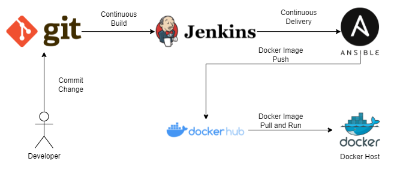

I set up a complete CI/CD pipeline for a simple java application using various DevOps tools such as: Git, Jenkins, Ansible, Docker Hub, Docker. All services were installed in EC2 instances: one used for Jenkins server, the second one was used for Ansible server and the third one used as a docker host. You can find below a diagram that simplifies the whole architecture of this project.

